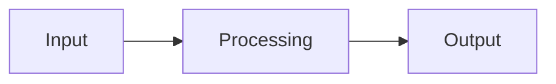

# AI Project Template

A starting point for AI/LLM engineering projects that ship with tests, evals, and CI from day one.

## Demo

_Add a GIF or link to a live demo here._

## Architecture



## Results

| Metric | Value |
|---|---|
| _placeholder_ | _placeholder_ |

## Technical decisions and trade-offs

_Document the key decisions and why you made them here. See `docs/decisions/` for ADRs._

## How to run

```bash
cp .env.example .env
docker compose up
```

Or locally with [`uv`](https://docs.astral.sh/uv/):

```bash
uv sync
make run     # run the app
make test    # run tests
make eval    # run evaluation
make lint    # lint with ruff
```

## Limitations and next steps

_List what's missing and what you'd do with more time._

## Resumo em português

Template de projeto para engenharia de IA/LLMs, já com testes, avaliação (evals) e CI
configurados desde o início. Para começar um novo projeto a partir dele: renomeie o
pacote em `src/`, ajuste o `pyproject.toml` e preencha as seções deste README (demo,
arquitetura, resultados, decisões e limitações).
